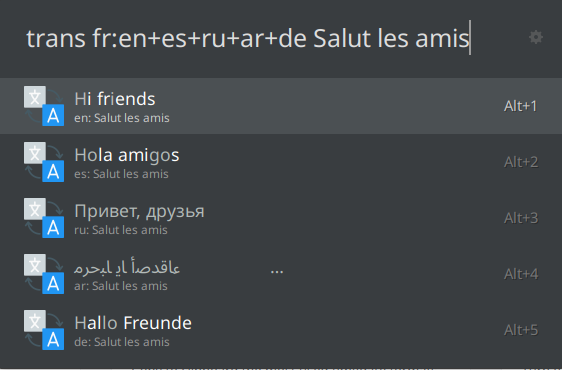

# Translate

This is a Ulauncher extension to translate.

## Table of Contents

- [Translate](#translate)
  - [Table of Contents](#table-of-contents)
  - [Screenshot](#screenshot)
  - [Installation](#installation)
    - [Requirements](#requirements)
    - [Ulauncher's GUI](#ulaunchers-gui)
    - [Manually from source](#manually-from-source)
  - [Configuration](#configuration)
  - [Usage](#usage)
    - [Langagues](#langagues)
    - [Options](#options)
  - [License](#license)

## Screenshot

## Installation

### Requirements

In order to work, this extension requires `translate-shell` to be installed.

Follow instruction: https://github.com/soimort/translate-shell#installation.

### Ulauncher's GUI

1. Open Ulauncher's settings and the "Extensions" tab
2. Click "Add extension" button
3. Paste this URL: `https://github.com/NastuzziSamy/ulauncher-translate`
4. Click "Add" button – the extension will be installed

### Manually from source

The extensions' directory is located at: `$HOME/.local/share/ulauncher/extensions`

Go to that location, and while being inside, just `git clone` this repository.

## Configuration

In Ulauncher's settings, you can custom some settings:
- Keyword
  - default: `trans`

- From lang: Lang uses for translation
  - default: `auto`
  - indicate lang code as `en`, `fr`, `es`

- To lang: Lang translate to
  - default: `auto`
  - indicate lang code as `en`, `fr`, `es`

## Usage

To translate, use the keyword (default is `trans`), then type/paste and wait for the extension to translate (0.5 sec after your last keypress).

Click/Press ENTER to copy the translation.

### Langagues

This extension translates with Google Translation.

By default, it will auto detect your language and translate.

Specify languages like this:
> Examples:
>
> - `trans en:fr` for English to French
>
> - `trans :fr` for (default `from_lang`) to French
>
> - `trans en:` for English to (default `to_lang`)

You can also translate into multiple languages using `+` operator:
> Example:
>
> - `trans en:fr+es` will translate to French and Spanish.

### Options

- `-sp`: Read what you entered
- `-p`: Read the translation

## License

[MIT License](LICENSE)
